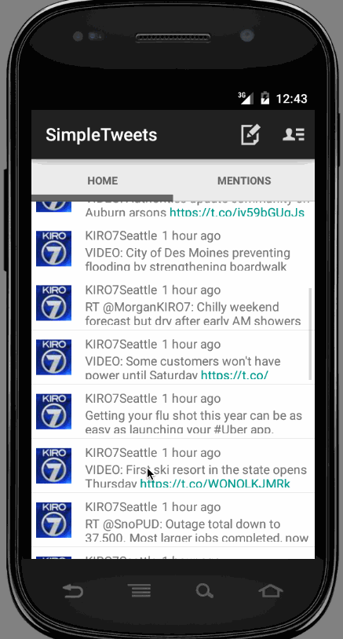

# Assignment 4 (built on 3) - *Twitter Client*

**Twitter Client** is a simplified twitter client, built for learning how to make android apps.

It is [Assignment #4](http://courses.codepath.com/courses/intro_to_android/unit/4#!assignment) for the [CodePath Android class](https://codepath.com/androidbootcamp).

Submitted by: **Jeff Martinez**

Time spent: ~**6** hours spent in total

## User Stories

The following **required** functionality is completed:

* [X] Includes **all required stories** from Week 3 assignment
* [X] User can switch between Timeline and Mention views using tabs
    * [X] User can view their home timeline tweets
    * [X] User can view their recent mentions of their username
* [X] User can navigate to **view their own profile**
    * [X] User can see picture, tagline, # of followers, # of following, and tweets on their profile.
* [X] User can **click on the profile image** in any tweet to see **another user's** profile
    * [X] User can see picture, tagline, # of followers, # of following, and tweets of clicked user.
    * [X] Profile view should include that user's timeline
    * [] Optional: User can view following / followers list through the profile
* [X] Users can [infinitely paginate](http://guides.codepath.com/android/Endless-Scrolling-with-AdapterViews) any of these timelines (home, mentions, user) by scrolling to the bottom

## Video Walkthrough

### Walkthrough for homework 4 (built on top of homework 3)

### Walkthrough for homework 3

GIFs created with [LiceCap](http://www.cockos.com/licecap/).

## Notes

### Challenges encountered

* Took me a bit of research to figure out how to hook up the click for the individual images, but not the entire list item. Using the get and set Tag methods was very useful for this.

## Open Source Libraries Used

* [James Smith's Android Asynchronous Http Client](http://loopj.com/android-async-http/)
* [Square's Picasso](http://square.github.io/picasso/)

## License

    The MIT License (MIT)

	Copyright (c) 2015 jeff martinez
	
	Permission is hereby granted, free of charge, to any person obtaining a copy
	of this software and associated documentation files (the "Software"), to deal
	in the Software without restriction, including without limitation the rights
	to use, copy, modify, merge, publish, distribute, sublicense, and/or sell
	copies of the Software, and to permit persons to whom the Software is
	furnished to do so, subject to the following conditions:
	
	The above copyright notice and this permission notice shall be included in all
	copies or substantial portions of the Software.
	
	THE SOFTWARE IS PROVIDED "AS IS", WITHOUT WARRANTY OF ANY KIND, EXPRESS OR
	IMPLIED, INCLUDING BUT NOT LIMITED TO THE WARRANTIES OF MERCHANTABILITY,
	FITNESS FOR A PARTICULAR PURPOSE AND NONINFRINGEMENT. IN NO EVENT SHALL THE
	AUTHORS OR COPYRIGHT HOLDERS BE LIABLE FOR ANY CLAIM, DAMAGES OR OTHER
	LIABILITY, WHETHER IN AN ACTION OF CONTRACT, TORT OR OTHERWISE, ARISING FROM,
	OUT OF OR IN CONNECTION WITH THE SOFTWARE OR THE USE OR OTHER DEALINGS IN THE
	SOFTWARE.
